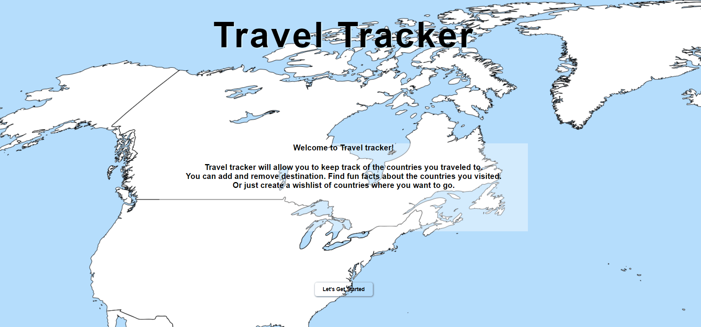
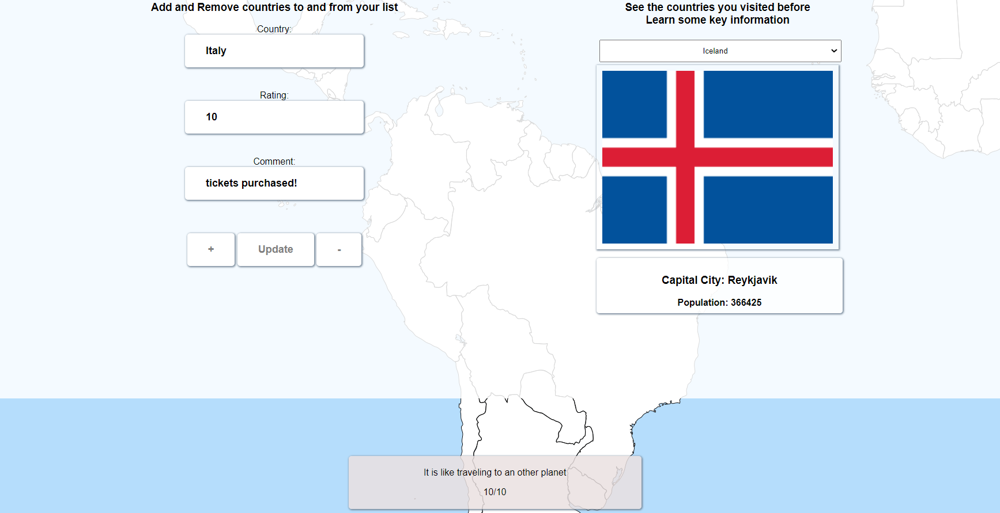

# Travel Tracker

## Description

Travel Tracker was created to keep track of the location the user would like to visit or just to make a wish list. Sometimes we are caught up with all the daily things we do and just forget our passion for travel. This application will help users stay on track by creating new locations getting some fun facts of the place they want to visit or just add the ideas they have for each of their future trips.
During this project I learned to use more extensively the CRUD operators and how to apply a custom API and public API and use them together.

## Usage

Start Localhost:

- json-server --watch db.json
  Start website:
- explorer.exe index.html

Belove a snapshot of the welcoming page where you can read a small description about the use of the website.

The use of website in action.

- Add name of country
- Your rating how much do you want to go there
- Some description what you did or what you want to do there
- The user can see some fun facts about the country on right side
  

## Badges

## Features

The list of places the user have been to or wants to go to.
There is a dropdown option for the list of the places the user been to or wishes to go to.
You can add remove new options to the list
when the list is clicked it pulls up an api.
The api will provide the following information / Funfacts:

- a picture of the google mapp location or flag of the country.
- capital city
- language
- neighbouring countries
- population
